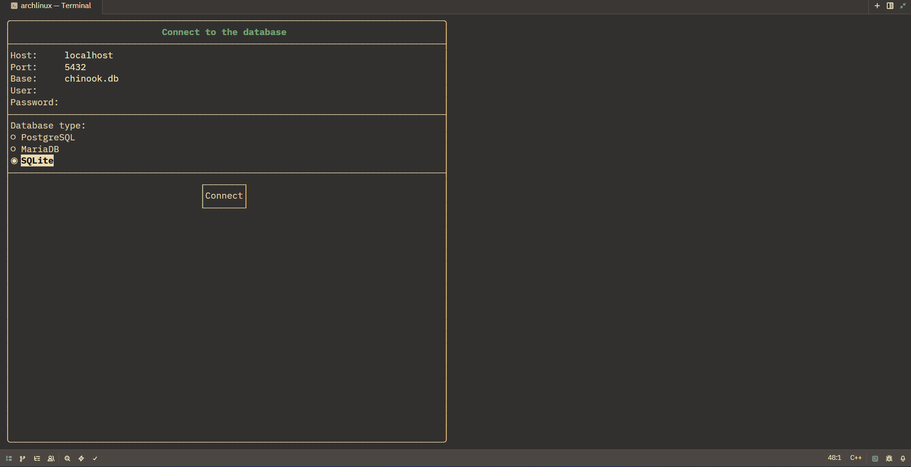
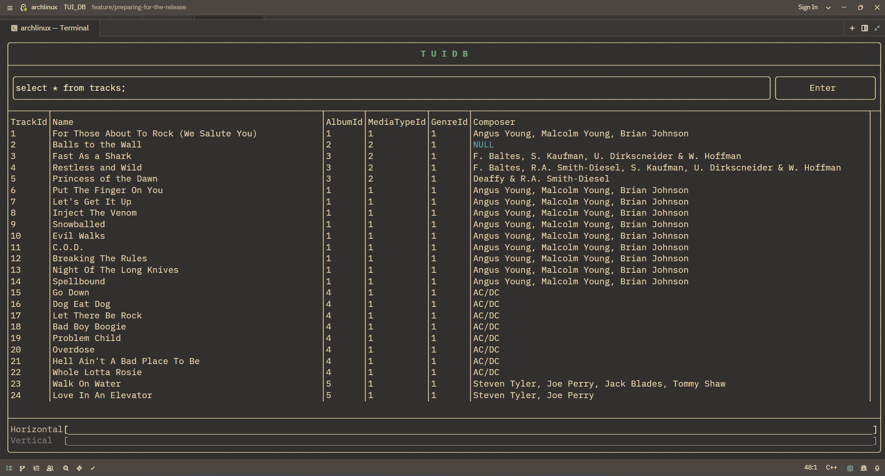

# TUI_DB

Simple TUI-app for working with database, SQLite and PostgreSQL.

**In the future Mariad db support.**

---

### Dependencies

#### It is set automatically:

1. ftxui
2. sqlite3
3. libpq
4. libpqxx

#### Need to install and configure:

1. vcpkg and install $VCPKG_ROOT on your system.
2. cmake and ninja.
3. Change file paths in CMakeUserPresets.json.

### Launch

#### Windows

```bash
cmake -B build --preset=windows
cmake --build build/
```

#### Linux

```bash
cmake -B build --preset=linux
cmake --build build/
```

After a successful build, when reconfiguring, you dont use this option _--preset=linux/windows_,
until you decide to recreate the _build_ folder.

---

See also a [small reference guide](doc/doc.md)
or [русская версия гайда](doc/doc_ru.md)

---

### Example

#### Login Form



#### Application Interface


